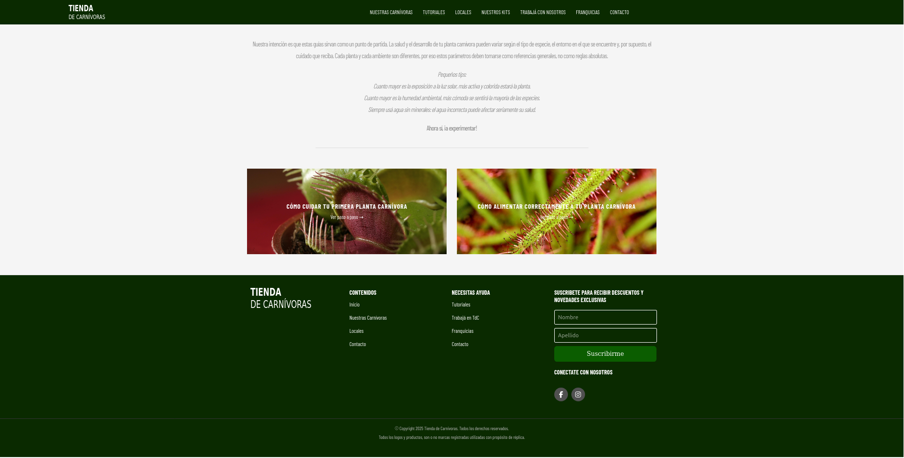
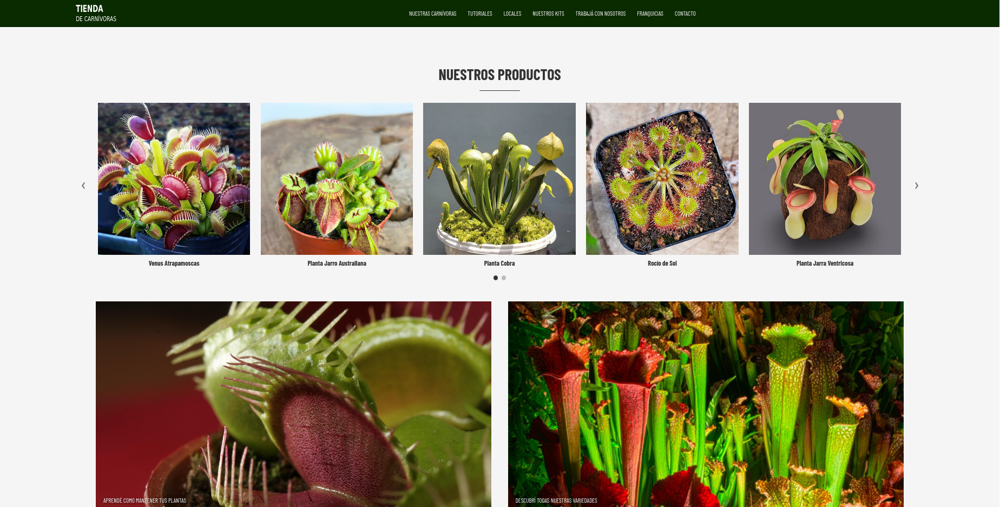
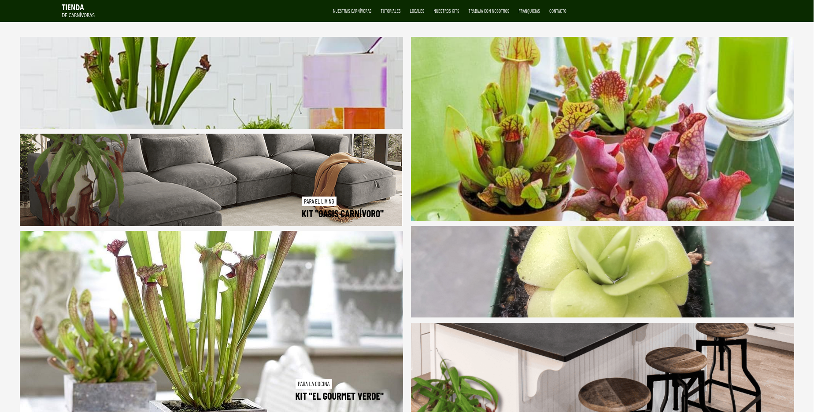
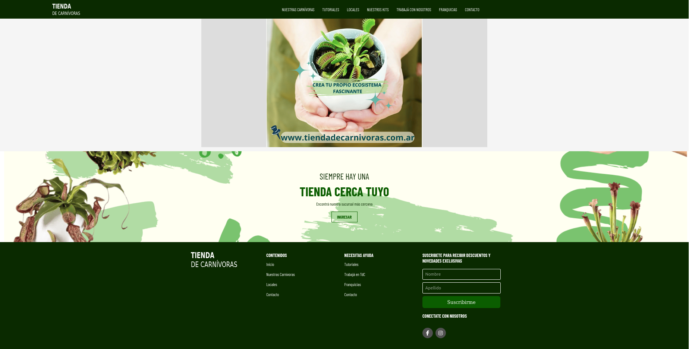
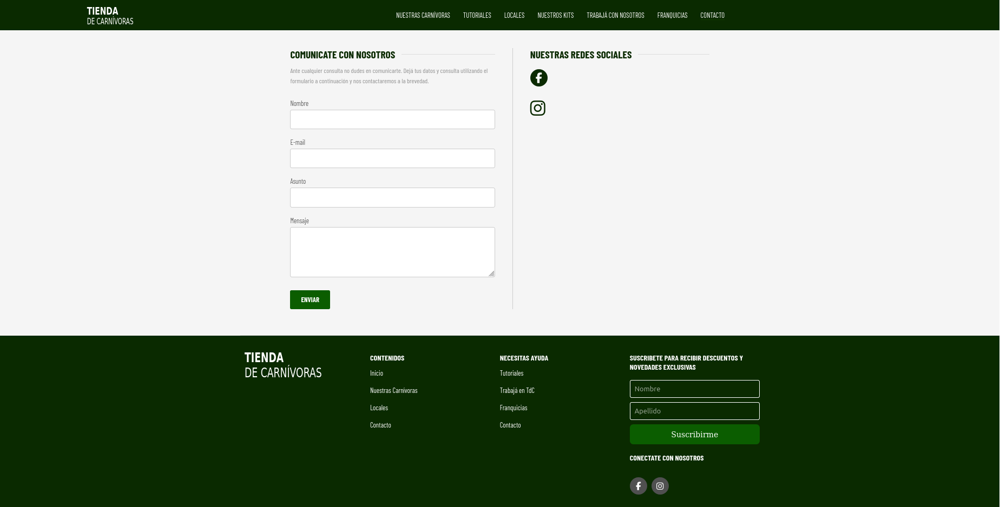
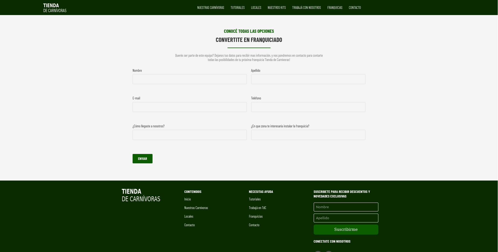

### 💻 Página Clonada - Proyecto Grupal

Este repositorio contiene una página web clonada basada en una tienda de café, adaptada para ofrecer plantas carnívoras como producto principal.

El desarrollo fue realizado utilizando HTML, CSS y JavaScript, manteniendo la estructura general del sitio original, pero adaptando el diseño visual con una paleta en tonos verdes para reflejar una estética más natural y relacionada con las plantas.

Se desarrollaron las siguientes pantallas:
Inicio (Index), Tienda, Nuestros Kits, Franquicias, Contacto, Trabajá con Nosotros y Tutoriales.

---  
### 👩🏻‍💻 Equipo
- Oliva, Marina
- Oliva, Melina
- Tamborelli, María Eugenia  
- Guardia Vero, Malena

---

### 📁 Estructura del proyecto  
```
├── css/              # Archivos CSS
│    ├── styles.css  
├── img/              # Imágenes y capturas de pantalla
│    ├── tienda
│    │   └── (...)  
│    └── tutoriales
│        ├── planta1.png
│        └── planta2.png
├── js/              # Archivos CSS
│    ├── scripts.js 

├── index.html          # Página principal
├── contacto.html       # Formulario de contacto
├── footer.html         # Footer reutilizable
├── franquicias.html    # Formulario para solicitar franquicias
├── header.html         # Header reutilizable
├── menu-tienda.html    # Nuestros Kits
├── tienda.html         # Tienda
├── trabaja-en-tdc.html # Formulario postulaciones laborales
├── tutoriales.html     # Tutoriales de cuidados.
└── README.md           # Documentación del proyecto
```

## 🚀 Deploy  

Visita la versión deployada en GitHub Pages: [https://malenavero.github.io/tp_obligatorio_front_2025_tienda_carnivoras/](https://malenavero.github.io/tp_obligatorio_front_2025_tienda_carnivoras/)

---

## 🛠 Tecnologías utilizadas  
- **HTML**  
- **CSS** (Grid, Flexbox, Media Queries)  
- **JavaScript** (para la inserción del nav y el footer)  
- **Font Awesome** (iconos)  


---

## 📸 Capturas de pantalla  








